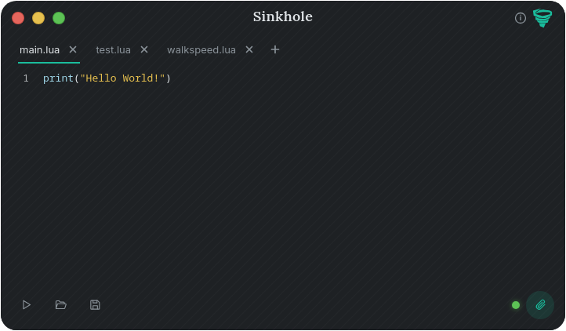

# Sinkhole



A closed-source Luau executor for Vortex.

Sinkhole gives you a small code editor, tabbed script management, and a one-click attach that hooks into a running Vortex process.

<br clear="right">

---

## Features

- **Tabbed Luau editor** - proper syntax highlighting, line numbers, auto-indent, electric dedent on `end` / `else` / `elseif` / `until`, multi-line indent/dedent, native undo/redo.
- **Attaching** - one button. Sinkhole finds the running Vortex process and tells you when it's ready.
- **Live state indicator** - a small dot next to the attach button tells you at a glance:
  - 🔴 not attached
  - 🟡 attached, not usable
  - 🟢 attached and ready to run
- **Autosave** - scripts persist to disk as you type. Tabs restore on relaunch.
- **Auto-update** - Sinkhole checks GitHub on launch and can update itself in place without reinstalling.
- **Cross-platform** - native Windows build, and a Linux build that works with Vortex running under Wine.
- **Works with any Wine install** - whether you launch Vortex under wine staging, Proton's wine, or stock wine, Sinkhole figures out the rest on its own.

---

## Download

Grab the latest release from the [releases page](https://github.com/mathhuge/sinkhole/releases/latest).

| Platform | File |
| --- | --- |
| Windows | `sinkhole-windows.exe` |
| Linux   | `sinkhole-linux` |

Both files are standalone.

---

## Requirements

**Windows**
- Windows 10 or 11
- [WebView2 runtime](https://developer.microsoft.com/microsoft-edge/webview2/) (already present on modern Windows)
- Vortex installed and running

**Linux**
- A working Wine installation (`wine`, `wine-staging`, etc.)
- `winepath` on `PATH` (ships with every Wine)
- WebKitGTK 4.1 at runtime (`libwebkit2gtk-4.1-0` on Debian/Ubuntu, `webkit2gtk4.1` on Fedora/Arch)
- Vortex installed and running with Wine

---

## Usage

1. **Launch Vortex first.** Sinkhole attaches to a running process.
2. **Launch Sinkhole.**
3. **Click the paperclip icon** in the bottom-right of the window to attach. The status dot turns yellow, then green once it's ready.
4. **Write your script.** Tabs are created with the `+` button, renamed with a double-click, and closed with the `x`.
5. **Press Run** (or `Ctrl+Enter`). Output appears as a toast at the bottom-right of the window.

### Keyboard shortcuts

| Shortcut | Action |
| --- | --- |
| `Ctrl+Enter` | Run the active tab |
| `Ctrl+S` | Save the active tab |
| `Ctrl+T` | New tab |
| `Ctrl+W` | Close tab |
| `Tab` / `Shift+Tab` | Indent / dedent (works on selections) |

---

## Where your data lives

Sinkhole keeps everything in your OS's standard app-data directory.

**Windows**
```
%APPDATA%\Sinkhole\
├── scripts\          ← your .lua tabs
├── workspace\        ← reserved for future use
└── preferences.json
```

**Linux**
```
~/.local/share/Sinkhole/
├── scripts\
├── workspace\
└── preferences.json
```

Scripts are plain `.lua` files. You can open them in any editor, drop new ones in, or delete them from outside Sinkhole. The editor picks up changes on next launch.

---

## Linux / Wine notes

Sinkhole doesn't ask you for a Wine prefix and doesn't care which Wine build you're using. It finds the running Vortex process, works out the environment it's running in, and uses exactly that.

If your Vortex is under wine-staging in `~/.vortex`, that's what Sinkhole uses. If it's under stock wine in `~/.wine`, it uses that instead. No manual switching.

---

## Known limitations

- **Scriptless games aren't supported.** Sinkhole needs a game prepared for scripting to run. The info icon in the top-right of the app flags this.
- **Windows is required for elevated targets.** If Vortex runs as administrator, Sinkhole must also run as administrator.
- **Antivirus false positives.** Injecting into another process is a technique that AV heuristics flag by design. If your AV eats the payload, whitelist the Sinkhole folder.

---

## Updating

Sinkhole checks GitHub on every launch. If a new release is available, the app icon pulses and a small **Update Available** label appears under the title. Click the icon to update.

The updater downloads the new binary, verifies its SHA-256 against what GitHub reports for the release asset, swaps it into place, and relaunches. The whole thing takes a few seconds and doesn't touch your scripts or preferences.

Manual updates are always fine — just replace the executable.

---

## Reporting bugs

Open an issue on the [issue tracker](https://github.com/mathhuge/sinkhole/issues) with:

- Your OS and (on Linux) which Wine build you're using
- Whether the game you were in at the time was scripted or scriptless
- A short description of what you expected vs. what happened
- Any error toast text, verbatim

Logs from the payload are written to:  
Windows: `C:\\vortex_tool_log.txt`  
Linux: `<wineprefix>/drive_c/vortex_tool_log.txt`  

Include the last ~30 lines if the issue happened during attach or run.
